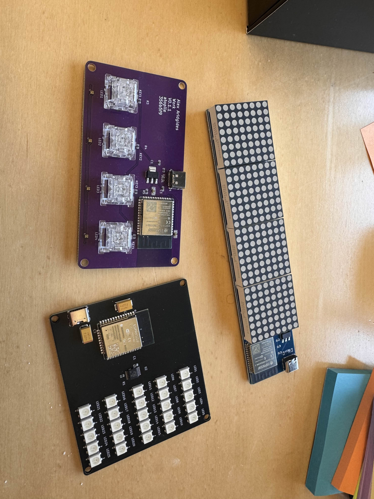

# WLED Board Workshop
## When I Discovered Code-Driven PCB Design

[](https://atopile.io/)
[](https://www.kicad.org/)
[](https://www.espressif.com/)
[](https://www.adafruit.com/product/1655)
[](LICENSE)

<p align="center">
    
</p>

This isn't just another LED controller board. It's the moment I realized PCB design could be as elegant and collaborative as software development.

Built during a workshop with Atopile's founders in San Francisco, this WiFi-enabled LED controller represents a complete paradigm shift: 25 individually addressable RGB LEDs controlled by an ESP32, all designed through code instead of traditional schematic capture. Every component placement, every connection, every design decision expressed in 85 lines of readable, maintainable, Git-trackable code.

## 💡 The Problem I Couldn't Ignore

I've always loved PCB design because it demands creativity and precision in an incredibly constrained environment. PCBs are the invisible backbone of innovation. Literally everything electronic runs off one. But despite this fundamental importance, the tools we use to design them are... frustrating.

Even after getting comfortable with Altium, there's always something breaking. No uniformity in how anyone uses the tools. Endless repetitive work: connecting the same resistor to every LED, manually routing similar circuits over and over. And collaboration? Forget about it. It's nothing like the seamless git workflow we take for granted in software.

The breaking point was realizing I couldn't reuse anything. Every 555 timer circuit, every power supply, every LED driver gets designed from scratch each time, even though they're fundamentally identical. 

That's when I started wondering: "What if PCB design worked like software development?"

## 🔍 What Atopile Actually Changes

This workshop wasn't just about learning a new tool. It was about discovering a completely different way to think about hardware design:

**Modularity**: Design a LED column once, instantiate it five times with `new LEDColumn[5]`.  
**Reusability**: Import someone else's ESP32 module and just use it.  
**Collaboration**: Git commits, pull requests, and merge conflicts... for hardware.  
**Automation**: Built-in assertions catch errors before they become expensive mistakes.  
**Speed**: 10x faster iteration because you're not manually placing and connecting everything.

The magic moment was looking at 85 lines of Atopile code and realizing it completely described a WiFi-enabled LED controller that would have taken me days to design traditionally.

## 🏗️ How It's Actually Built

The elegance is in how everything connects. Here's the complete architecture in 85 lines of code:

### The Modular Approach
```ato
# Five LED columns, each with 5 WS2812B LEDs
led_columns = new LEDColumn[5]

# Power them all with a simple loop
for led_column in led_columns:
    power_5v ~ led_column.power_5v

# Chain the data signals
led_columns[0].data_out ~ led_columns[1].data_in
led_columns[1].data_out ~ led_columns[2].data_in
# ...and so on
```

That's it. No manual component placement, no repetitive connections. Define the pattern once, scale it infinitely.

### The Circuit Reality (It's pretty simple)
- **ESP32-WROOM-32-N4**: WiFi-enabled microcontroller running the show
- **SN74AHCT125PWR**: Level shifter converting 3.3V logic to 5V LED signals  
- **USB-C power**: Clean 5V input with proper decoupling (470µF caps where they belong)
- **100Ω series resistor**: Signal integrity for the data line
- **25 WS2812B LEDs**: Individually addressable RGB pixels in a 5×5 matrix

### Why This Matters Technically
Traditional PCB tools would require manually placing 25 LEDs, drawing 75+ connections, and praying you didn't miss anything. With Atopile, you define a `LEDColumn` module once and instantiate it five times. Change your mind about the LED count? Edit one number. Need different LEDs? Swap the import. Want 10 columns instead of 5? `new LEDColumn[10]`.

<p align="center">
    
</p>

## 🛠️ Try It Yourself

Clone this repo and you'll have a working WLED controller in minutes:

```bash
git clone https://github.com/your-username/wled-board-atopile-workshop.git
cd wled-board-atopile-workshop

# Generate the complete board layout
ato build

# Or build just the LED column for testing
ato build led_column
```

**Prerequisites**: [Atopile](https://atopile.io/) 0.9.2+, [KiCad](https://www.kicad.org/) 7.0+, and Git

The real magic happens when you start modifying. Want 10 LED columns instead of 5? Change one line: `led_columns = new LEDColumn[10]`. Need different LEDs? Swap the import in `LEDColumn.ato`. Add sensors? Create new `.ato` modules and import them. 

This is what modular hardware design looks like.

## 📁 Project Structure

```
wled-board-atopile-workshop/
├── main.ato                    # Main WLED controller with ESP32, level shifter, power management
├── LEDColumn.ato              # Reusable LED column module (5 WS2812B LEDs)
├── ato.yaml                   # Atopile project configuration and build targets
├── layouts/                   # Generated KiCad PCB layouts
│   ├── default/              # Complete board layout
│   └── led_column/           # Individual LED column for testing
├── parts/                    # Component libraries with specs and 3D models
│   ├── Espressif_Systems_ESP32_WROOM_32_N4/
│   ├── Texas_Instruments_SN74AHCT125PWR/    # Level shifter
│   ├── XINGLIGHT_XL_5050RGBC_WS2812B/       # RGB LEDs
│   ├── SHOU_HAN_TYPE_C_6P/                  # USB-C connector
│   └── ...                   # Passive components (resistors, capacitors)
├── assembled_boards.jpg      # Final boards in action
├── kicad_3d_model.png       # 3D render
└── workshop_photo.jpeg      # Workshop memories
```

The beauty is in the organization: everything needed for a complete PCB design, from component libraries to 3D models, all version-controlled and shareable.

## 📷 San Francisco Workshop

<p align="center">
    
</p>

This board came to life during an incredible weekend in San Francisco. Ioannis and Narayan, Atopile's co-founders, hosted me and two friends while I was in town for Y Combinator's AI Startup School. What struck me wasn't just their technical brilliance, but how genuinely excited they get about solving real problems in hardware design.

The learning curve was real. Switching from visual schematics to thinking about circuits as code took genuine mental rewiring. But watching a complete PCB design emerge from readable, logical code? That moment of understanding felt like discovering a superpower.

## 🔮 What This Actually Enables

Here's what gets me excited about where this is heading:

**Right now**: I can design a functional PCB in the time it used to take me to place components.  
**Soon**: AI will generate working circuit modules from simple prompt.   
**Eventually**: Hardware development becomes as collaborative and fast as software. [Have a look at this LinkedIn post from Ioannis](https://www.linkedin.com/posts/ioannis-papamanoglou_looks-like-llms-can-build-hardware-now-activity-7346651478536646657-VoHD?utm_source=share&utm_medium=member_desktop&rcm=ACoAADRcZ2gB1nHtYN8_9pezp5tOuHOZ3t4stl4).

The bigger picture isn't just faster PCB design. It's bringing hardware development into the same ecosystem of tools, practices, and collaboration that made software development so powerful. When every circuit is a reusable module, when hardware designs can be forked and improved like code, when AI can generate working PCBs from prompts... that changes everything.

## 🙏 Thanks

Massive thanks to Ioannis and Narayan for the incredible workshop and for building something that genuinely changes how we think about hardware design. They're not just improving tools, they're redefining what's possible.

I'm always willing to learn new things if they help me work faster, create better quality, and raise my baseline. Atopile delivers on that promise in ways I didn't think were possible.

---

This isn't just a WLED board. It's proof that the future of hardware design is already here. When I look at these 85 lines of code that completely describe a WiFi-enabled LED controller, I see the same revolutionary potential that transformed software development decades ago.

The paradigm shift is happening. Code-driven hardware is real, and it's incredible.

**License**: Apache 2.0 ([LICENSE.txt](LICENSE.txt))

*P.S. - If you're still wrestling with traditional schematic capture, try Atopile. Your future self will thank you.*
